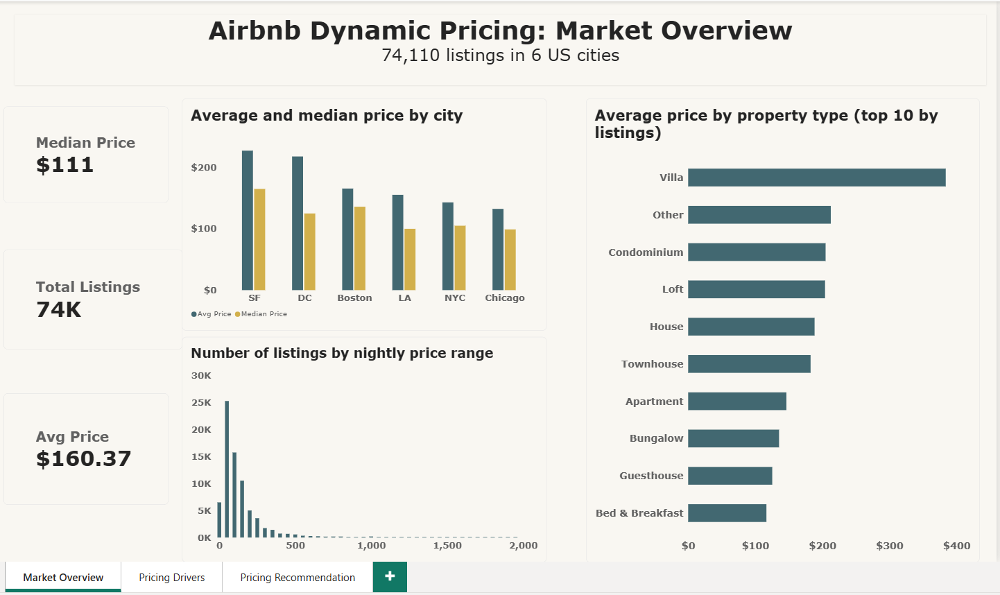
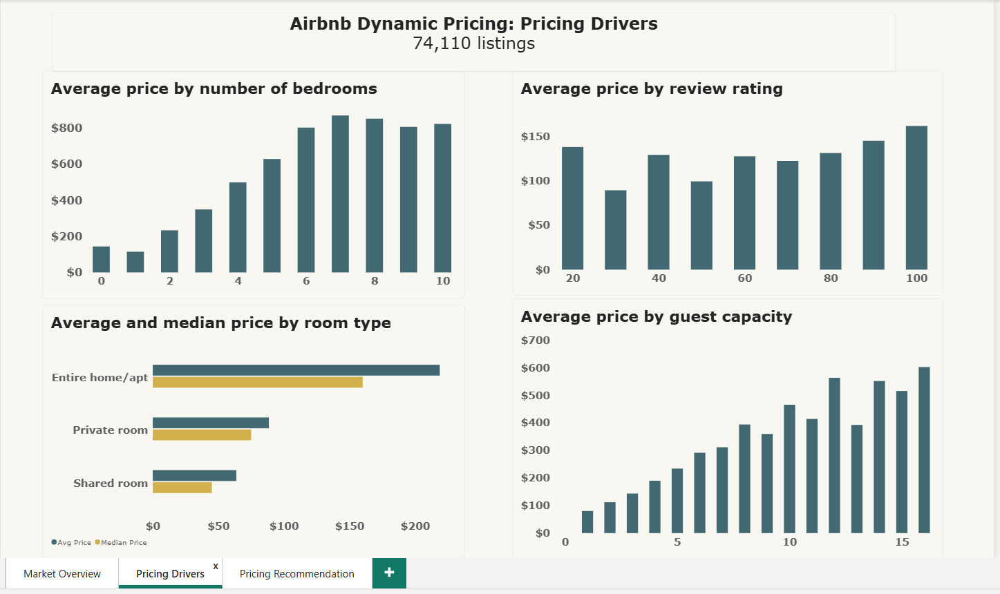
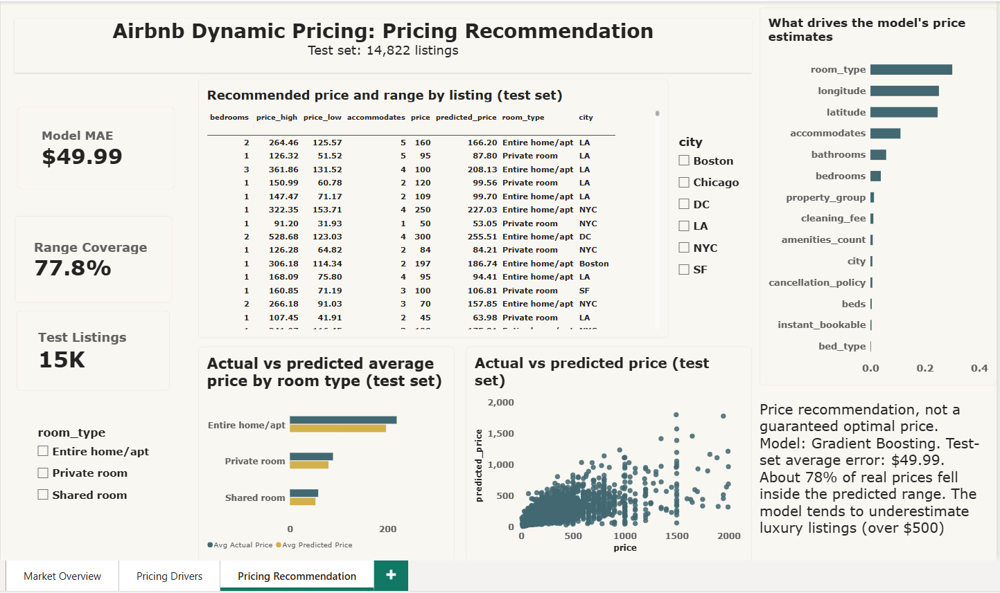

# Airbnb Dynamic Pricing Recommendation Engine

An end-to-end analytics project that studies what drives Airbnb nightly prices and builds a regression model that gives a **price recommendation** (an estimated nightly price plus a likely range) for a listing.

It combines data cleaning (Power Query), business analysis (MySQL), exploratory analysis and modeling (Python), and a three-page Power BI dashboard.

> This is a price *recommendation*, not a claim of the mathematically optimal price. The data has no booking or demand information, so it cannot show which price maximizes revenue.

---

## Business problem

Hosts must decide how much to charge per night. Price varies with location, room and property type, capacity, size, and other listing features. This project uses historical listing data to:

1. Describe the market and the factors associated with higher or lower prices.
2. Estimate a reasonable nightly price, with a range, for a listing.

---

## Dashboard preview

| Market Overview | Pricing Drivers | Pricing Recommendation |
|---|---|---|
|  |  |  |

---

## Data

- **Source:** Kaggle dataset [ADD DATASET TITLE, AUTHOR AND LINK HERE]. License listed on the Kaggle page: Apache 2.0 (https://www.apache.org/licenses/LICENSE-2.0). The Kaggle page has no description, so the original origin of the data is not documented.
- **Size:** 74,111 listings and 29 columns in the raw file; **74,110 listings** after cleaning.
- **Cities:** San Francisco, Washington DC, Boston, Los Angeles, New York City, Chicago.
- **Target:** `log_price` (natural log of the nightly price). Results are converted back to dollars with `exp()`.
- **Not in this dataset:** minimum nights and availability.

The raw and cleaned data files are not included in this repository because of their size (about 100 MB). Download the raw file from the Kaggle page above.

---

## Methodology

1. **Data quality check:** data types, missing values, duplicates, invalid values, outliers.
2. **Cleaning (Power Query):** fixed data types (dates, percentages, true/false columns); added a dollar `price` column (`exp(log_price)`); removed one record with a $1 nightly price (a data-entry error); corrected 34 entire-home listings that had 0 bathrooms to 1 and flagged them (`bathrooms_imputed`); trimmed text columns; dropped `zipcode` and `thumbnail_url` (location is covered by city, latitude and longitude). Rows with missing review fields were kept.
3. **SQL analysis (MySQL):** ten business questions on price by property type, city, capacity, bedrooms, ratings, reviews, and price segments. SQL was also used to validate the numbers shown in Power BI.
4. **Exploratory analysis (Python):** price distribution, correlations, categorical drivers, category counts.
5. **Feature engineering:** grouped rare property types into "Other", counted amenities, and split the data 80/20 (random state 42) **before** filling missing values, so no test information leaks into training.
6. **Modeling:** baseline, linear regression, random forest and gradient boosting, compared on a held-out test set and with 5-fold cross-validation on the training data.
7. **Recommendation:** two extra gradient boosting models (10th and 90th percentile) give a price range around the estimate.
8. **Dashboard (Power BI):** market overview, pricing drivers, and the model's recommendation results.

**Leakage choices:** the main model uses only information a host knows when setting a price (room and property type, capacity, bedrooms, beds, bathrooms, bed type, cancellation policy, cleaning fee, instant bookable, city, latitude, longitude, amenity count). Review fields and host response rate are excluded, because new listings do not have them and review volume partly depends on past bookings.

---

## Key findings

These are associations in the data, not proof of cause and effect.

- **Prices are right-skewed:** the median nightly price is **$111** while the average is **$160.37**, because a smaller group of expensive listings pulls the average up. Modeling `log_price` reduces the skew from 4.3 to 0.52.
- **Room type matters most:** entire homes average about **$219** (median $160), private rooms about **$88** (median $75), and shared rooms about **$64** (median $45).
- **City matters:** by average price, SF ($227) and DC ($218) are the highest, then Boston ($166), LA ($155), NYC ($143) and Chicago ($132). Within each room type the city ranking stays similar.
- **Size matters:** average price rises from about $80 for 1 guest to about $603 for 16 guests, and from about $115 for 1 bedroom to about $499 for 4 bedrooms.
- **High-priced listings are mostly large entire homes:** the top 10% of listings ($300 to $1,999) average 6 guests and 2.4 bedrooms, and 93.2% are entire homes.
- **Reviews and ratings relate only weakly to price.** Listings without a rating average about $204, higher than rated listings in every room type. Possible reasons were not tested.

---

## Model results

Test set: 14,822 listings. Errors are in dollars after converting predictions back from the log scale.

| Model | MAE | RMSE | R² (log price) | R² ($) |
|---|---|---|---|---|
| Baseline (average) | $87.73 | $171.95 | 0.000 | -0.060 |
| Linear Regression | $59.17 | $126.36 | 0.579 | 0.428 |
| Random Forest | $50.59 | $113.09 | 0.685 | 0.542 |
| **Gradient Boosting (final)** | **$49.99** | **$111.56** | **0.693** | **0.554** |

5-fold cross-validation R² (log price) on training data: Linear 0.567, Random Forest 0.675, Gradient Boosting 0.684. Gradient boosting was chosen because it was slightly better on both checks; the two tree models perform about the same.

**Most important features** (permutation importance, drop in R²): room type (0.30), longitude (0.25), latitude (0.25), accommodates (0.11), bathrooms (0.06), bedrooms (0.04). City scores low only because latitude and longitude already encode location.

**Where the model works and where it does not** (test set):

| Actual price | Listings | Average error (MAE) | Range coverage |
|---|---|---|---|
| Up to $50 | 1,297 | $20.1 | 60% |
| $50 to $100 | 4,992 | $19.9 | 83% |
| $100 to $150 | 3,104 | $29.3 | 84% |
| $150 to $250 | 3,532 | $46.7 | 81% |
| $250 to $500 | 1,344 | $102.9 | 69% |
| Over $500 | 553 | $399.9 | 46% |

The model is most reliable for typical listings ($50 to $250). It tends to overestimate cheap listings and underestimate luxury listings.

**Price range:** the 10th to 90th percentile range contained 77.8% of real test prices (target 80%), with a median width of $92.

**Example (illustrative):** a 2-bedroom entire apartment in New York City for 4 guests gets an estimate of $229 with a range of $154 to $322. The median of 2,508 similar listings (same city, room type and bedroom count, capacity within one guest) is $190, with a middle half of $140 to $250.

---

## Limitations

- No minimum-nights or availability data, and no booking or demand data, so this cannot estimate an optimal revenue-maximizing price.
- It is not known whether listings were booked at the recorded price.
- Prices appear capped near $2,000, and the model underestimates luxury listings (over $500).
- The price range covers 77.8% of real prices, slightly below the 80% target, and is weaker at the price extremes.
- 39 listings under $15 and 6 listings over $1,500 with 2 or fewer guests look suspicious. They were flagged in SQL and kept in the data.
- Review fields were left out of the main model, so the model does not use rating or review history.
- Neighbourhood (619 values, with gaps) was left out; location comes from latitude, longitude and city.
- One snapshot of six US cities; results may not apply to other markets or times.
- Correlations do not prove causation.

---

## Repository structure

```
airbnb-pricing-recommendation/
├── README.md
├── sql/
│   ├── setup_and_load.sql
│   └── analysis.sql
├── notebooks/
│   └── airbnb_eda_model.ipynb
├── outputs/
│   ├── model_predictions.csv
│   └── feature_importance.csv
└── screenshots/
```

`model_predictions.csv` (test-set predictions and price ranges) is created by the last cells of the notebook and feeds Page 3 of the dashboard. The Power BI file is not included because of its size (about 37 MB), so the screenshots show the dashboard.

## How to reproduce

1. Get the dataset from the source above and clean it in Power Query as described in the methodology.
2. Run `sql/setup_and_load.sql` (set the file path first), then `sql/analysis.sql`, in MySQL.
3. Run `notebooks/airbnb_eda_model.ipynb` from top to bottom (Kernel, then Restart and Run All).
4. The dashboard was built in Power BI Desktop from the cleaned table and the model outputs (see the screenshots above).

## Tools

Power Query and Power BI, MySQL, Python (pandas, NumPy, scikit-learn, matplotlib), Jupyter Notebook.
